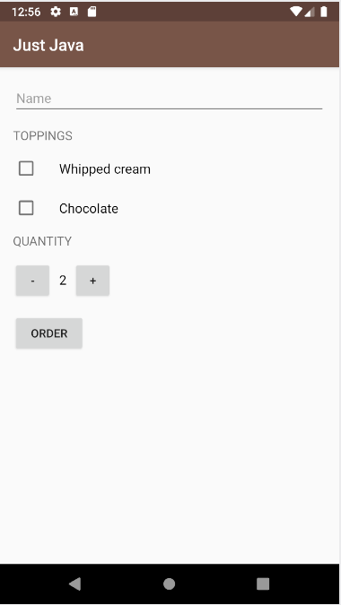

# just-java
Coffee ordering app from the Android Basics: User Input Udacity course.

## Features:
- Scroll view with linear layout to select personalized coffee order
- Placing order allows customer to receive email containing order receipt

## Screenshots
